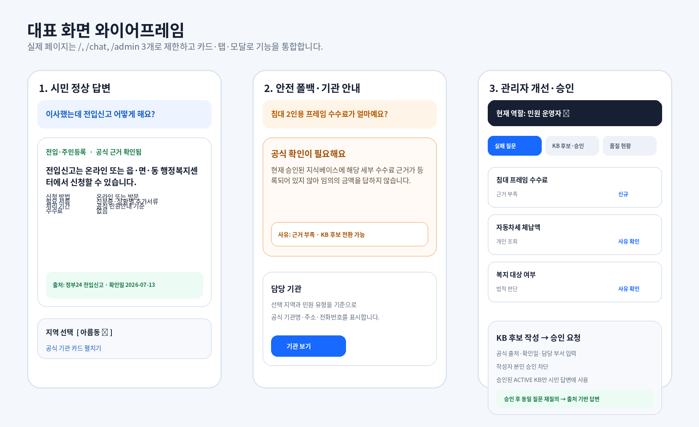
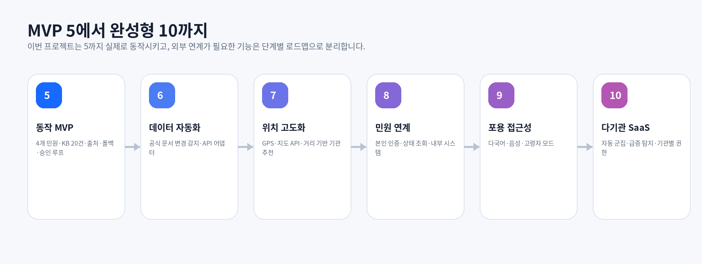
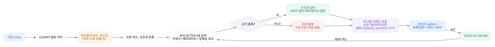

# 세종 민원 AI 길잡이 전체 프로젝트 계획서

> **최종 제품**: 시민용 민원 AI 플랫폼 + 관리자용 AI 민원 운영센터  
> **프로젝트 기간**: 2026-07-06 ~ 2026-07-31  
> **팀 규모**: 4명  
> **문서 버전**: v2.2  
> **팀명·팀원·연락처·제출일**: 제출 전 직접 입력

## 1. 프로젝트 정의

> 세종 민원 AI 길잡이는 시민의 일상어 질문을 공식 행정 지식과 연결하고, 근거가 있는 질문은 출처와 함께 끝까지 안내하며, 근거가 부족한 질문은 개인정보를 제거한 뒤 사람이 검수·승인할 수 있는 KB 개선 후보로 전환하는 운영형 공공 AI 플랫폼이다.

### 핵심 원칙

> **모르면 지어내지 않고, 알면 끝까지 안내한다.**

### 최종 차별화

```text
시민 질문
→ 공식 KB 검색
→ 답변 또는 안전 폴백
→ 실패 질문 비식별 저장
→ 운영자 사유 확인
→ KB 후보 작성
→ 승인자 승인·반려
→ ACTIVE KB 반영
→ 동일 질문 재질의 개선
```


## 2. 확정 범위

### 2.1 지원 분야

| 분야 | MVP 역할 | 대표 질문 |
| --- | --- | --- |
| 전입·주민등록 | 대표 사용자의 이사 시나리오 | 이사했는데 전입신고 어떻게 해요? |
| 증명서 발급 | 절차·수수료·기관 카드 | 등본은 어디서 발급해요? |
| 대형폐기물 | 개선 전후 회귀 시나리오 | 침대 프레임 수수료가 얼마예요? |
| 지방세 일반 안내 | 개인 조회 폴백 시연 | 내 자동차세 체납액 알려줘 |

### 2.2 우선순위 정의

| 등급 | 의미 | 이번 프로젝트 |
| --- | --- | --- |
| P0 | 대표 흐름과 인수 기준에 직접 연결 | 반드시 구현 |
| P1 | 핵심 흐름을 보조하는 확정 기능·검증 | 반드시 구현 |
| P2 | 외부 연계·고도화가 필요한 기능 | 로드맵, 미구현 |

### 2.3 실제 페이지

```text
/
- 서비스 소개·지원 분야·진입

/chat
- 질문·답변 카드·출처·후속질문·폴백
- 지역 선택·공식 기관 카드
- 쉬운 말·큰 글씨

/admin
- 실패 질문 탭
- KB 후보·승인 탭
- 품질 현황 탭
- 상세·작성·승인 모달
- 데모용 역할 전환
```



## 3. P0 구현 목록

| ID | 기능 | 완료 기준 | 담당 |
| --- | --- | --- | --- |
| P0-01 | 자연어 질문·의도 분류 | 4개 분야·범위 밖·모호 질문을 구분 | AI/Data+BE |
| P0-02 | 공식 KB 검색 | ACTIVE KB만 검색하고 사용 source_id 반환 | AI/Data+BE |
| P0-03 | 구조화 답변·출처 | 절차·서류·기간·수수료·기관·출처 카드 | FE+BE |
| P0-04 | 후속질문 | 모호 질문 2개에 선택형 FOLLOWUP | AI/Data+FE |
| P0-05 | 4개 안전 폴백 | 사유·다음 행동·기관 안내·후보 적격성 | AI/Data+BE |
| P0-06 | 개인정보 마스킹 | 외부 LLM 전 마스킹, 원문 DB 미저장 | BE |
| P0-07 | 지역·기관 매칭 | 3개 지역과 공식 기관 데이터 | BE+FE |
| P0-08 | 실패 질문 목록 | masked_question·사유·상태·텍스트 만료일 표시, 만료 후 파기 빈 상태 | FE+BE |
| P0-09 | KB 후보 작성 | 근거 부족 질문만 후보 작성 가능 | FE+BE+AI/Data |
| P0-10 | 승인·반려 | 작성자 본인 승인 차단, 승인 KB 활성화 | BE+PM |
| P0-11 | 재질의 개선 | REG-01 전체 흐름 완주 | 전체 |

## 4. P1 확정 구현·검증

| 기능 | 구현 기준 |
| --- | --- |
| 쉬운 말 | 사전 기반 핵심 행정 용어 전환 |
| 큰 글씨 | 주요 본문 16px→20px, 제목 20px→24px |
| 기본 명도 대비 | 일반 본문 4.5:1 이상, 상태를 색상만으로 표현하지 않음 |
| 키보드 접근성 | 탭 순서·포커스 링·모달 닫기·포커스 복귀 |
| 실패 질문 필터 | 사유·상태·민원 유형 필터 |
| 품질 현황 | 운영 이벤트와 표본 테스트 수치를 배지로 구분 |
| 감사 이력 | 상태·행위·대상 ID·변경 필드명 저장 |
| 응답시간 | 평균·p95·오류율 측정 |
| 100명 스모크 테스트 | 캐시된 검색/고정 응답 경로, 1분, 실서비스 보증 아님 |

## 5. P2 로드맵

- 실제 GPS와 거리 계산
- 지도 API 내장
- 본인 인증과 신청 상태 조회
- 정부24·지자체·내부 행정 시스템 연계
- 다국어·음성·고령자 단계 축소 모드
- 유사 실패 질문 자동 클러스터링
- 급증 민원 탐지와 주간 리포트
- 전체 KB CRUD·버전 비교
- 다기관 SaaS·SSO·RBAC·전자결재



## 6. 데이터 계획

| 데이터 | 확정 수량 | 성격 | 책임 |
| --- | --- | --- | --- |
| 공식 KB | 20건 | 실제·공식 데이터 | AI/Data·Backend 작성, PM 전수 승인 |
| 공식 기관 | 3개 이상 | 실제·공개 데이터 | Backend 작성, PM 전수 승인 |
| 지역×민원 매핑 | 10~12건 | 팀 규칙 | Backend 작성, PM 전수 검수 |
| 표본 질문 | 20개 | 사람 확정 평가셋 | AI/Data+PM |
| 회귀 테스트 | 1개 | 개선 전후 통합 테스트 | 전체 |
| 실패 질문 mock | 20~30건 | 시연용 샘플 | AI/Data |
| 운영 이벤트 mock | 50~100건 | 시연용 샘플 | BE |
| KB 후보 mock | 5~10건 | 시연용 샘플 | AI/Data |

### 공식 데이터 책임과 완료 목표

| 담당 | 업무 |
| --- | --- |
| AI/Data | 공식 KB 작성, 형식 관리, 표본 질문 초안 |
| Backend | 공식 KB·기관 데이터 작성, 스키마·로그 필드 검증 |
| PM | 공식 KB 20건·기관 3건의 출처·표현·확인일·승인 상태와 지역×민원 매핑 10~12건을 전수 검수 및 승인 |
| Frontend | 승인 데이터의 기관 표시·출처 카드 표시 QA; 공식 내용 작성·승인 권한 없음 |

완료 목표는 2026-07-20이다. PM 승인 전 레코드는 staging이며 시민 답변 검색 대상이 아니다.

## 7. 시스템 설계



### 기술 스택

| 영역 | 확정 선택 | 비고 |
| --- | --- | --- |
| Frontend | Next.js + TypeScript + Tailwind CSS, Node 24.x+pnpm | 초기 로컬 실행; Vercel은 공개 배포 승인 후 |
| Backend | FastAPI + Python 3.12+uv | 초기 로컬 실행·백업; Render는 공개 배포 승인 후 |
| DB | Supabase PostgreSQL + Supabase CLI 버전 SQL migration | Docker local stack 우선; 원격 push·파괴 변경은 별도 승인 |
| 검색 | 키워드+메타데이터 기본, 임베딩 보조 | KB 20건에서 예측 가능성 우선 |
| LLM | 사용자 기존 DeepSeek API 잔액 + provider adapter | `deepseek-v4-flash`, thinking off, max 1024, concurrency 1, retry 1, run당 outbound attempt 30; local/private 합성 전용, disabled/template fallback 필수 |
| 차트 | Recharts | 기본 KPI만 |
| 테스트 | Pytest, Playwright, k6/Locust, 수동 표본 평가 | 품질·UI·성능 분리 |

### 핵심 데이터 저장

```text
interaction_events
- 질문 문장 없음
- intent, answer_status, fallback_reason
- source_count, response_time_ms, selected_region

failed_questions
- masked_question
- fallback_reason, candidate_eligible, text_expires_at, text_purged_at
- 30일 후 masked_question만 NULL; 행·비텍스트 메타데이터·후보 연결 유지

kb_candidates
- 사람 작성 답변·공식 출처·확인일
- created_by, reviewed_by, review_status

kb_documents
- ACTIVE만 시민 검색

audit_logs
- 상태·행위·필드명만 저장
- 질문·답변 전체 스냅샷 미저장
```

## 8. 개인정보·폴백 정책

### 폴백 규칙

| 사유 | KB 후보 | 텍스트 저장 |
| --- | --- | --- |
| INSUFFICIENT_GROUNDING | 가능 | 마스킹 후 30일 |
| PERSONAL_LOOKUP | 불가 | 필요 시 마스킹 후 30일 |
| LEGAL_JUDGMENT | 불가 | 필요 시 마스킹 후 30일 |
| OUT_OF_SCOPE | 불가 | 질문 텍스트 저장 금지, 이벤트만 |
| FOLLOWUP | 해당 없음 | 실패 질문 목록 미저장 |

### 외부 AI

- 외부 LLM 호출 전 백엔드에서 개인정보를 마스킹한다.
- 마스킹된 질문과 승인된 KB 청크만 전달한다.
- 공급자는 사용자가 보유한 기존 DeepSeek API 잔액을 사용하며 새 충전·자동 충전은 하지 않는다. 키는 backend 환경변수에만 둔다.
- DeepSeek 호출은 클라이언트 플래그가 아니라 서버 allowlist로 확인한 local/private 합성 fixture에만 허용한다. 실제 시민 질문·PII·민감정보·공개 환경 요청은 provider에 전송하지 않는다.
- DeepSeek의 기본 디스크 context cache와 고정되지 않은 전체 보관기간을 고려해 ACTIVE KB 최소 청크만 전달하고 `user_id`에는 개인정보를 넣지 않는다.
- `deepseek-chat`·`deepseek-reasoner` legacy alias와 다른 model ID를 거부하고 정확히 `deepseek-v4-flash`를 사용한다. thinking off, `max_tokens=1024`, 동시 호출 1, 요청당 재시도 최대 1회, 한 process run에서 재시도를 포함한 외부 전송 시도 총 30회를 강제한다.
- `DEEPSEEK_ENABLED=false`가 기본이며 명시적 synthetic evaluation mode와 서버 fixture allowlist가 모두 참일 때만 호출한다. 한도 도달·429·잔액 부족은 자동 충전이나 무한 재시도 없이 template 또는 정책 폴백으로 전환한다.
- LLM 장애 시 구조화 KB 템플릿을 반환하고, 근거가 없으면 안전 폴백한다.

### 마스킹·대화·오류 경계

- 이름·상세주소는 재현율 우선으로 보수적으로 가린다. 답변 성공률 80% 미달의 원인이 과잉 마스킹으로 입증돼도 정밀도 우선으로 자동 전환하지 않고 인간 재승인을 받는다.
- 화면상 대화 기록과 15분 서명형 `context_token`은 현재 브라우저 탭 메모리에만 둔다. 서버 세션·raw 대화문·token을 DB/로그에 저장하지 않고 새로고침·탭 종료 시 화면 기록을 없앤다.
- token에는 서버 정의 enum/ID와 발급·만료 시각만 허용하며 질문·답변·PII·URL·공식 사실을 넣지 않는다. 만료·위변조 token은 문맥 없는 새 요청으로 처리하고 인증·권한·ACTIVE KB·근거 판단에 사용하지 않는다.
- 정책 폴백은 HTTP 200이다. provider/DB 장애라도 ACTIVE KB·검증 snapshot으로 안전 응답이 가능하면 200이고, 안전 대체가 없을 때만 HTTP 503 `SERVICE_UNAVAILABLE`을 반환한다.

## 9. 팀 역할

| 역할 | 최종 책임 | 3주차 핵심 |
| --- | --- | --- |
| PM·제안서·QA·KB 승인자 | 범위·문서·정책·승인·발표 | 승인 체크리스트·테스트 판정 |
| Frontend | /, /chat, /admin·반응형·접근성 | 탭·모달·카드 통합 |
| Backend | API·DB·마스킹·상태·배포 | 승인 권한·이벤트·성능 |
| AI/Data·민원 운영자 | KB·검색·폴백·평가 | 공식 KB 10건+후보 작성 |

## 10. 주차별 실행계획

### 2주차: 7/13~7/17

| 날짜 | PM | FE | BE | AI/Data | 완료 게이트 |
| --- | --- | --- | --- | --- | --- |
| 7/13 | 최종 범위·제안서 구조 | 3페이지 와이어프레임 | DB/API 확정 | 4개 분야·폴백 확정 | 범위 동결 |
| 7/14 | 문제·시장·수익모델 | 홈·채팅 기본 UI | chat mock·이벤트 구조 | 공식 KB 5건 | 정상 답변 데모 |
| 7/15 | 개인정보·승인 정책 | 답변·출처·폴백 카드 | 마스킹·실패 로그 | KB 10건·표본 초안 | 폴백 저장 데모 |
| 7/16 | 로드맵·예산·RFP 표 | 지역·기관 카드 | 기관 API·사유 코드 | 기관 데이터·매핑 | 기관 안내 데모 |
| 7/17 | 제안서 v2 제출본 | 시민 흐름 통합 | Chat·로그 통합 | KB 15건·질문 20개 | 제안서·중간 시연 |

### 3주차: 7/20~7/24

| 날짜 | PM | FE | BE | AI/Data | 완료 게이트 |
| --- | --- | --- | --- | --- | --- |
| 7/20 | 관리자 검수 시나리오 | 실패 질문 탭 | 목록·상세 API | KB 20건 완료 | 실패 목록 동작 |
| 7/21 | 승인 체크리스트 | 상세·후보 모달 | 사유 정정·후보 API | 후보 샘플 | 후보 작성 동작 |
| 7/22 | 역할·권한 검수 | 역할 전환·승인 모달 | 권한 차단·감사 이력 | 후보 출처 검토 | 승인 동작 |
| 7/23 | 테스트 기준 | 품질 현황 탭 | 품질·성능 API | 표본 테스트 1차 | KPI 표시 |
| 7/24 | 중간 리허설 | 모바일 통합 | 회귀·로컬 백업 | 실패 분석 | P0/P1 통합 완료 |

### 4주차: 7/27~7/31

| 날짜 | PM | FE | BE | AI/Data | 완료 게이트 |
| --- | --- | --- | --- | --- | --- |
| 7/27 | 발표자료 초안 | UI 버그 수정 | 오류 처리 | 표본 테스트 2차 | 기능 동결 |
| 7/28 | 제안서·계획서 정합 | 접근성·모바일 | 로그·보관·부하 | 품질 수치 확정 | 문서·지표 일치 |
| 7/29 | 발표자료 완성 | 화면 polish | 배포·로컬 백업 | 테스트 리포트 | 최종 데모 |
| 7/30 | 리허설 2회 | 데모 지원 | 장애 대응 | 예상 질문 | 발표 게이트 |
| 7/31 | 최종 발표 | 데모 | 데모 | QA | 제출 완료 |

## 11. 테스트·성공 기준

| 지표 | 목표 | 판정 |
| --- | --- | --- |
| 답변 성공률 | 80% 이상 | 정상 10개 중 8개 이상 |
| 출처 표기율 | 100% | 직접 답변에 출처 누락 0건 |
| 적절한 폴백률 | 87.5% 이상 | 폴백 8개 중 7개 이상 |
| 후속질문 성공률 | 100% | 모호 질문 2개 모두 FOLLOWUP |
| 개인정보 마스킹률 | 100% | DB·로그 원문 0건 |
| 승인 없는 KB 노출 | 0건 | DRAFT/PENDING 검색 결과 0건 |
| 회귀 흐름 | 1회 완주 | 승인 전 폴백→승인 후 답변 |
| 응답시간 | 평균 3초 목표 | 평균·p95·오류율 공개 |
| 100명 스모크 | 오류율 1% 미만 목표 | 캐시 경로 1분, 용량 보증 아님 |

마스킹 완화 검토는 같은 20문항 평가셋에서 답변 성공률 80% 미달과 과잉 마스킹의 인과를 함께 기록한 경우에만 시작한다. 개인정보 마스킹률 100% 기준은 완화하지 않는다.

## 12. 데모 시나리오

1. `이사했는데 전입신고 어떻게 해요?` → 공식 KB 답변·출처
2. `신고하고 싶어요.` → 선택형 후속질문
3. `내 자동차세 체납액 알려줘.` → PERSONAL_LOOKUP 폴백
4. 지역 `아름동` 선택 → 공식 기관 카드
5. `침대 2인용 프레임 수수료가 얼마예요?` → 승인 전 근거 부족
6. 관리자 운영자 역할로 후보 작성
7. 승인자 역할로 공식 출처 검수·승인
8. 동일 질문 재질의 → 10,000원·출처 카드
9. 품질 현황에서 운영 이벤트·표본 테스트·시연용 샘플 배지 구분

## 13. 리스크 통제

| 리스크 | 통제 |
| --- | --- |
| 기능 범위 증가 | 3페이지·4개 분야·단일 승인 루프 동결 |
| FE 부담 | 탭·카드·모달·공통 컴포넌트 재사용 |
| KB 품질 부족 | 20건만 전원 분담, 출처대장 전수 검수 |
| 개인정보 외부 전송 | 외부 LLM 호출 전 마스킹 |
| 승인 없는 배포 | ACTIVE 필터와 작성자 본인 승인 차단 |
| mock 수치 오해 | 이벤트 집계·MVP 표본·시연용 샘플 배지 |
| 데모 장애 | 고정 KB·템플릿 답변·로컬 백업·녹화 |
| 제안서와 MVP 불일치 | RFP 대응표와 인수 기준을 개발 백로그에 연결 |

## 14. 최종 완료 기준

- [ ] `/`, `/chat`, `/admin`이 모바일·데스크톱에서 동작
- [ ] 공식 KB 20건과 출처대장 완성
- [ ] 공식 기관 데이터 3개 이상
- [ ] 4개 폴백과 FOLLOWUP 구분
- [ ] 외부 LLM 전 마스킹
- [ ] 성공 이벤트와 실패 로그 정책 구현
- [ ] 운영자·승인자 역할 분리
- [ ] 회귀 테스트 REG-01 완주
- [ ] 표본 질문 20개 결과 기록
- [ ] 평균·p95·오류율과 100명 스모크 결과 기록
- [ ] 제안서·계획서·발표자료·MVP 범위 일치
