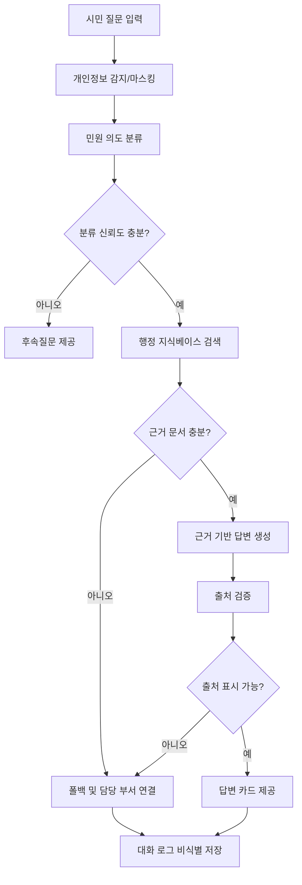
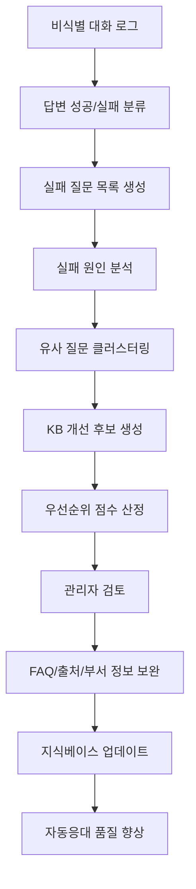

# 01. 전체 설계도 — 세종 민원 AI 길잡이

## 0. 문서 목적

이 문서는 RFP 「AI 기반 시민 민원 통합 응대 플랫폼 구축」을 기준으로 우리가 실제로 만들 제품의 전체 구조를 정의한다. 최종 결과물은 단순 챗봇이 아니라 **시민용 민원 AI 플랫폼**과 **관리자용 AI 민원 운영센터**가 결합된 운영형 공공 AI 플랫폼이다.

## 1. 최종 제품 정의

### 1.1 제품명

**세종 민원 AI 길잡이**

### 1.2 한 문장 정의

> 세종 민원 AI 길잡이는 시민이 일상 언어로 민원을 질문하면 AI가 행정 지식베이스에 근거하여 절차·서류·처리기간·수수료·담당 기관을 안내하고, 관리자는 답변 실패 질문과 민원 데이터를 분석하여 지식베이스를 지속적으로 개선하는 공공 AI 민원 플랫폼이다.

### 1.3 제품 구성

```text
세종 민원 AI 길잡이
├─ A. 시민용 민원 AI 플랫폼
│  ├─ 자연어 민원 질문
│  ├─ 민원 의도 분류
│  ├─ 절차·서류·처리기간·수수료 안내
│  ├─ 출처 기반 답변
│  ├─ 후속질문
│  ├─ 폴백 및 담당 부서 연결
│  ├─ 기관/주민센터 안내
│  └─ 모바일 우선 UI
│
├─ B. 관리자용 AI 민원 운영센터
│  ├─ 운영 현황 Overview
│  ├─ 답변 실패 질문 관리
│  ├─ 민원 자동 분석
│  ├─ 지식베이스 개선 추천
│  ├─ 답변 품질 리포트
│  ├─ 담당 부서 연결 현황
│  └─ 주간 민원 인사이트 리포트
│
└─ C. 공통 AI/데이터 엔진
   ├─ 행정 지식베이스
   ├─ 기관/부서 데이터
   ├─ 비식별 대화 로그
   ├─ 민원 의도 분류
   ├─ RAG/검색 기반 답변
   ├─ 출처 검증
   └─ 개인정보 마스킹/환각 방지
```

## 2. 핵심 차별화 전략

### 2.1 기존 민원 챗봇의 한계

일반적인 민원 챗봇은 시민 질문에 답변하고 종료된다. 이 구조에서는 AI가 답변하지 못한 질문이 운영 개선 데이터로 연결되지 못하고, 지식베이스의 빈틈도 담당자가 직접 발견해야 한다.

### 2.2 우리 팀의 차별점

본 서비스는 **답변 실패 질문을 행정 정보 개선 과제로 전환**한다. AI가 답변하지 못한 질문은 단순 실패가 아니라, 시민이 실제로 궁금해하지만 현재 지식베이스가 충분히 설명하지 못하는 행정 정보의 빈틈이다.

```text
답변 실패
→ 실패 질문 저장
→ 실패 원인 분류
→ 유사 질문 묶음
→ 개선 우선순위 산정
→ FAQ/출처/담당부서 보완 추천
→ 다음부터 자동응대 가능
```

### 2.3 차별점 이름

**AI 민원 운영센터** 또는 **민원 개선 루프 대시보드**

### 2.4 발표용 핵심 문장

> 다른 팀이 시민에게 답변하는 챗봇을 만든다면, 우리는 챗봇이 답하지 못한 질문까지 분석해 다음 행정 개선 과제로 바꾸는 운영형 AI 민원 플랫폼을 만든다.

## 3. 사용자와 관리자 관점의 서비스 흐름

### 3.1 시민용 서비스 흐름



### 3.2 관리자용 개선 루프



## 4. 시민용 플랫폼 상세 설계

### 4.1 주요 화면

| 화면 | 목적 | 핵심 요소 |
|---|---|---|
| 홈 | 서비스 소개 및 대표 질문 진입 | 대표 민원 버튼, 질문 입력창 |
| 챗봇 | 자연어 민원 상담 | 대화 UI, 답변 카드, 출처 카드 |
| 민원 상세 | 특정 민원 절차 안내 | 절차, 서류, 기간, 수수료, 주의사항 |
| 기관 찾기 | 담당 기관/부서 연결 | 동 선택, 기관 카드, 지도/전화 링크 |
| 상태 조회 | 시연용 접수번호 조회 | mock 접수번호, 진행 단계 |
| 접근성 설정 | 고령자·저시력자 편의 | 큰 글씨, 쉬운 말, 고대비, 읽어주기 |

### 4.2 시민용 핵심 기능

| 기능 | 설명 | RFP 대응 |
|---|---|---|
| 자연어 Q&A | 시민 질문을 일상어로 입력 | SFR-001 |
| 민원 의도 분류 | 질문을 전입, 세금, 복지, 인허가 등으로 분류 | SFR-002 |
| 절차·서류 안내 | 필요 서류, 신청 방법, 처리 기간, 수수료 제공 | SFR-003 |
| 기관·담당 연결 | 가까운 주민센터/부서/연락처 안내 | SFR-004 |
| 후속질문 | 질문이 모호할 때 조건을 좁힘 | SFR-005 |
| 폴백 | 신뢰도가 낮으면 담당 부서 연결 | SFR-006 |
| 출처 기반 답변 | 모든 답변에 근거 문서 표시 | SER-003, COR-001 |
| 모바일 우선 | 스마트폰 기준 반응형 UI | COR-002 |

### 4.3 답변 카드 표준 포맷

```json
{
  "intent": "MOVE_IN_REPORT",
  "title": "전입신고 안내",
  "summary": "전입신고는 이사 후 새 주소를 등록하는 민원입니다.",
  "steps": [
    "새 주소와 세대 정보를 확인합니다.",
    "신분증 등 필요 서류를 준비합니다.",
    "정부24 또는 주민센터에서 신청합니다.",
    "처리 결과를 확인합니다."
  ],
  "documents": ["신분증", "전입신고서", "상황별 추가 서류"],
  "processing_time": "즉시 또는 기관 확인 필요",
  "fee": "무료 또는 상황별 확인",
  "department": "읍면동 주민센터",
  "sources": ["KB-001 전입신고 안내 FAQ"],
  "confidence_level": "높음",
  "fallback": false
}
```

## 5. 관리자용 AI 민원 운영센터 상세 설계

### 5.1 대시보드 메뉴 구조

```text
/admin
├─ Overview
├─ Failed Questions
├─ Civil Analytics
├─ KB Recommendations
├─ Quality Report
├─ Department Routing
└─ Weekly Insight Report
```

### 5.2 Overview KPI

| KPI | 설명 | 예시 |
|---|---|---:|
| 총 질문 수 | 기간 내 전체 질문 수 | 328건 |
| 자동 답변 성공률 | 출처 기반 답변 성공 비율 | 84% |
| 폴백 비율 | 담당 부서 연결/답변 불가 비율 | 16% |
| 평균 응답시간 | 일반 질의 평균 처리 시간 | 1.7초 |
| 출처 표기율 | 답변에 출처가 포함된 비율 | 100% |
| 개인정보 감지 | 주민번호/전화번호 등 탐지 건수 | 8건 |
| 신규 KB 후보 | 지식베이스 보완이 필요한 항목 | 12건 |

### 5.3 답변 실패 질문 관리

실패 질문은 다음 기준으로 분류한다.

| 실패 원인 | 설명 | 처리 방식 |
|---|---|---|
| 지식베이스 없음 | 관련 FAQ/문서 없음 | FAQ 추가 후보 |
| 출처 부족 | 답변 근거가 부족함 | 공식 출처 보완 |
| 질문 모호함 | 질문이 너무 짧거나 범위 불명확 | 후속질문 개선 |
| 개인별 조회 필요 | 세금 체납액, 신청 상태 등 | 담당 부서/공식 시스템 연결 |
| 담당 부서 불명확 | 어느 부서로 넘길지 데이터 부족 | 부서 매핑 보완 |
| 최신 정보 필요 | 신청 기간/공고 등 변동 정보 | 최신 공고 확인 |

### 5.4 민원 자동 분석

자동 분석 항목은 다음과 같다.

1. 민원 유형별 질문 비중
2. 시간대별 문의 추이
3. 지역/동별 주요 민원
4. 폴백 유형별 건수
5. 담당 부서 연결 현황
6. 급증 민원 탐지
7. 주요 키워드 추출
8. 민원 유형별 자동답변 성공률

### 5.5 지식베이스 개선 추천

개선 후보는 다음 점수로 우선순위를 부여한다.

```text
개선 우선순위 = 질문 빈도 × 실패율 × 최근 증가율 × 민원 중요도
```

예시:

| 개선 후보 | 빈도 | 실패율 | 증가율 | 우선순위 |
|---|---:|---:|---:|---:|
| 대형폐기물 품목별 수수료 | 21 | 32% | +40% | 92 |
| 반려동물 등록 FAQ | 12 | 100% | +25% | 86 |
| 청년 월세 지원 기간 | 15 | 80% | +60% | 84 |

## 6. 공통 데이터 구조

### 6.1 핵심 엔티티

| 엔티티 | 설명 |
|---|---|
| Category | 전입, 세금, 복지 등 민원 대분류 |
| CivilService | 세부 민원 항목 |
| KBDocument | 행정 지식베이스 원문/FAQ |
| KBChunk | 검색 단위 청크 |
| Office | 주민센터/부서 정보 |
| Conversation | 비식별 대화 세션 |
| Message | 질문/답변 로그 |
| FailedQuestion | 답변 실패 질문 |
| KBRecommendation | 지식베이스 개선 후보 |
| EvaluationCase | 테스트 질문 |
| EvaluationRun | 품질평가 결과 |

### 6.2 로그 저장 시 필수 필드

| 필드 | 설명 |
|---|---|
| session_id | 익명 세션 ID |
| question_masked | 마스킹된 질문 |
| intent | 분류된 민원 유형 |
| answer_status | answered / fallback / clarification |
| fallback_reason | 실패 원인 |
| source_count | 사용된 출처 수 |
| response_time_ms | 응답시간 |
| office_routed | 연결된 담당 부서 |
| user_area | 사용자가 선택한 동/읍/면 |
| created_at | 발생 시각 |

## 7. AI 파이프라인 설계

### 7.1 처리 단계

```text
1. 입력 수신
2. 개인정보 탐지 및 마스킹
3. 프롬프트 인젝션/위험 요청 필터링
4. 민원 의도 분류
5. 신뢰도 판단
6. 지식베이스 검색
7. 근거 문서 재랭킹
8. 답변 생성
9. 출처 검증
10. 폴백/후속질문/정상답변 중 하나 반환
11. 비식별 로그 저장
12. 관리자 분석 데이터 반영
```

### 7.2 폴백 기준

다음 중 하나라도 해당하면 직접 답변하지 않는다.

- 관련 근거 문서가 없음
- 출처가 0개임
- 질문이 개인별 정보 조회를 요구함
- 법적·복지 수급 여부의 최종 판단을 요구함
- 질문이 너무 모호하여 민원 유형을 특정할 수 없음
- 개인정보가 포함되어 안전 안내가 필요한 경우

## 8. 기술 아키텍처

### 8.1 추천 스택

| 영역 | 추천 기술 |
|---|---|
| Frontend | Next.js + TypeScript + Tailwind CSS |
| Backend | FastAPI + Python |
| Database | PostgreSQL + pgvector 또는 Supabase |
| AI | LLM API + Embedding Search + 정책 기반 폴백 |
| 지도 | Kakao/Naver/Google 지도 링크 또는 API |
| 음성 | Web Speech API |
| 배포 | Vercel + Render/Railway/Supabase |

### 8.2 대안 스택

개발 난이도를 낮추려면 Streamlit + SQLite + CSV 기반 검색으로도 구현 가능하다. 단, 발표 완성도와 화면 구성은 Next.js 기반이 더 유리하다.

## 9. MVP 범위

### 9.1 반드시 구현할 범위

- 시민용 자연어 챗봇
- 민원 의도 분류
- 절차·서류·처리기간·수수료 카드
- 출처 기반 답변
- 후속질문/폴백
- 담당 부서 연결
- 관리자 Overview
- 답변 실패 질문 목록
- 민원 자동 분석
- 지식베이스 개선 추천
- 품질 리포트

### 9.2 선택 구현

- mock 상태조회
- 지도 연동
- 다국어 일부
- 음성 입력/읽기
- 주간 리포트 자동 생성
- KB CRUD

## 10. 확장 로드맵

| 단계 | 확장 내용 |
|---|---|
| 1단계 | 대표 민원 10개 분야 자동응대 및 관리자 대시보드 구축 |
| 2단계 | 실제 공공 API·지도 API 연동, 기관 데이터 자동 갱신 |
| 3단계 | 접수번호 기반 상태조회, 인증 연계, 부서 업무 시스템 연동 |
| 4단계 | 다국어·음성 고도화, 고령자/외국인 접근성 강화 |
| 5단계 | 지자체 SaaS 모델로 확장, 다기관 공통 지식베이스 운영 |

## 11. 최종 한 문장

> 세종 민원 AI 길잡이는 시민에게 답변하는 챗봇에서 끝나지 않고, 답변 실패 질문과 민원 로그를 분석해 행정 지식베이스를 지속적으로 개선하는 운영형 공공 AI 플랫폼이다.
