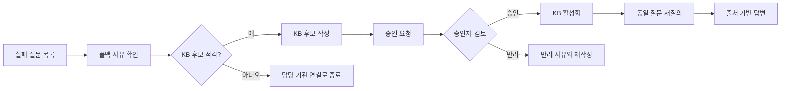

# 세종 민원 AI 길잡이 전체 프로젝트 계획서

> **프로젝트명**: 세종 민원 AI 길잡이  
> **제품 방향**: 시민용 민원 AI 플랫폼 + 관리자용 AI 민원 운영센터  
> **대상 RFP**: 공고번호 2026-세종-0001, AI 기반 시민 민원 통합 응대 플랫폼 구축  
> **프로젝트 기간**: 2026-07-06 ~ 2026-07-31  
> **팀 규모**: 4인  
> **작성 기준일**: 2026-07-13  
> **구현 기준**: P0·P1 확정 구현, P2 고도화 로드맵  
> **핵심 원칙**: 모르면 지어내지 않고, 알면 끝까지 안내한다.

---

## 0. 프로젝트 개요

세종 민원 AI 길잡이는 시민이 일상 언어로 민원을 질문하면 행정 지식베이스에 근거한 답변과 출처를 제공하고, 근거가 부족하거나 개인별 조회·전문 판단이 필요한 질문은 담당 기관으로 안전하게 연결하는 공공 민원 안내 플랫폼이다.

서비스는 시민용 챗봇에서 끝나지 않는다. AI가 답변하지 못한 질문은 개인정보를 제거한 뒤 관리자용 AI 민원 운영센터에 저장되며, 관리자는 폴백 사유를 확인하고 공식 출처를 기반으로 지식베이스 개선 후보를 작성한다. 지정된 승인자가 후보를 검토·승인하면 해당 정보가 지식베이스에 반영된다.

```text
시민 질문
→ 개인정보 탐지·마스킹
→ 민원 의도 분류
→ 행정 KB 검색
→ 출처 기반 답변 또는 안전 폴백
→ 실패 질문 비식별 저장
→ 관리자 폴백 사유 확인
→ KB 개선 후보 작성
→ 담당자 승인·반려
→ 승인된 후보 KB 반영
→ 같은 유형 질문의 다음 응답 개선
```

### 0.1 최종 제품 구성

```text
세종 민원 AI 길잡이
├─ 시민용 민원 AI 플랫폼: /chat
│  ├─ 자연어 질문
│  ├─ 민원 의도 분류
│  ├─ 절차·서류·기간·수수료 안내
│  ├─ 출처 기반 답변
│  ├─ 선택형 후속질문
│  ├─ 네 가지 폴백 사유 처리
│  ├─ 지역 선택
│  └─ 샘플 주민센터·담당 기관 안내
│
├─ 관리자용 AI 민원 운영센터: /admin
│  ├─ 실패 질문 목록
│  ├─ 폴백 사유 확인
│  ├─ KB 개선 후보 작성
│  ├─ 담당자 승인·반려
│  ├─ 승인 이력
│  └─ MVP 품질 현황
│
└─ 공통 AI·데이터 영역
   ├─ 공식 출처 기반 행정 KB
   ├─ 기관·지역 매핑 데이터
   ├─ 비식별 실패 질문 로그
   ├─ 폴백 정책
   ├─ 개인정보 마스킹 정책
   └─ 표본 질문 평가셋
```

### 0.2 실제 페이지 수

프론트엔드는 기능별로 페이지를 분리하지 않고, 카드·탭·모달을 사용해 세 개의 페이지로 구성한다.

| 경로 | 역할 | 주요 구성 |
|---|---|---|
| `/` | 홈·서비스 소개 | 핵심 가치, 대표 민원, 챗봇 시작, 관리자 진입 |
| `/chat` | 시민용 민원 AI | 채팅, 답변 카드, 출처, 후속질문, 폴백, 지역·기관 안내 |
| `/admin` | 관리자 운영센터 | 실패 질문, KB 후보·승인, 품질 현황 탭 |

---

## 1. 프로젝트 한 줄 정의

> **세종 민원 AI 길잡이는 시민에게 근거 기반 민원 안내를 제공하고, 답변 실패 질문을 공식 지식베이스 개선으로 연결하는 운영형 공공 AI 플랫폼이다.**

---

## 2. 핵심 메시지

### 2.1 시민에게 전달할 메시지

> 민원 절차는 쉽게, 답변 근거는 투명하게, 어려운 질문은 담당 기관으로 안전하게.

### 2.2 평가자에게 전달할 메시지

> 시민에게 답변하는 챗봇을 넘어, 실패 질문을 검토·승인 가능한 지식베이스 개선 후보로 전환하는 운영 구조를 구현한다.

### 2.3 팀 내부 의사결정 기준

> 모르면 지어내지 않고, 알면 끝까지 안내한다.

다음 중 하나라도 충족하지 못하면 AI는 직접 답변하지 않는다.

- 검색된 공식 근거가 없다.
- 답변 내용이 검색된 근거 범위를 넘어선다.
- 개인 인증 또는 개인 행정정보가 필요하다.
- 법적·자격·행정 처분의 최종 판단이 필요하다.
- 지원 민원 범위를 벗어난다.

---

## 3. RFP 분석

### 3.1 RFP의 핵심 문제

| 문제 | 시민에게 미치는 영향 | 행정에 미치는 영향 |
|---|---|---|
| 전화·방문 중심 | 근무시간 외 즉시 안내가 어려움 | 반복 문의가 담당자 시간을 차지함 |
| 행정 정보 분산 | 필요한 절차와 서류를 찾기 어려움 | 창구별 안내가 달라질 수 있음 |
| 답변 근거 불투명 | 안내의 신뢰성을 판단하기 어려움 | 잘못된 안내가 민원 혼선으로 이어짐 |
| 개인별·복합 민원 | 단순 FAQ만으로 해결되지 않음 | 적절한 담당 부서 연결이 필요함 |

### 3.2 RFP의 요구 방향

1. 시민의 자연어 질문을 이해한다.
2. 민원 의도를 분류한다.
3. 필요한 서류, 신청 방법, 처리 기간, 수수료를 단계별로 안내한다.
4. 답변마다 근거 출처를 제시한다.
5. 질문이 모호하면 후속질문을 한다.
6. 불확실하거나 답변하기 어려우면 담당 기관으로 폴백한다.
7. 기관·부서·연락처·위치 데이터를 관리한다.
8. 대화 로그는 비식별 형태로 저장해 품질 개선에 활용한다.
9. 개인정보를 최소 수집하고 근거 없는 답변을 금지한다.
10. 모바일 우선과 표본 질의 정확성 점검을 고려한다.

### 3.3 우리 팀의 과업 해석

```text
RFP 기본 과업
민원 질문 → 근거 답변 → 담당 기관 연결

우리 팀 제품 구조
민원 질문 → 근거 답변 또는 폴백
→ 실패 질문 비식별 저장
→ 운영자 검토
→ 공식 KB 후보 작성
→ 승인자 검증
→ KB 반영
→ 다음 응답 개선
```

차별점은 분석 기능의 수가 아니라, **실패 질문이 실제 승인 절차를 거쳐 지식베이스에 반영되는 하나의 완결된 개선 루프**이다.

---

## 4. 문제 정의

현재 시민 민원 안내는 전화, 방문, 여러 행정 사이트에 분산되어 있어 시민이 자신의 상황에 필요한 절차와 서류를 빠르게 확인하기 어렵다. 반복 문의는 담당자의 업무 시간을 소모하고, 부서별로 안내 기준이 다르면 시민은 같은 질문에도 다른 답을 받을 수 있다.

AI 챗봇을 도입하더라도 근거 없는 답변을 생성하거나 개인별 판단이 필요한 민원을 단정하면 새로운 위험이 발생한다. 따라서 본 프로젝트는 다음 두 가지 문제를 함께 해결한다.

1. 시민이 24시간 일상 언어로 민원 절차와 담당 기관을 확인할 수 있어야 한다.
2. AI가 답하지 못한 질문이 방치되지 않고, 관리자 검토와 승인 과정을 통해 공식 지식베이스 개선으로 연결되어야 한다.

### 4.1 사용자별 문제와 해결

| 사용자 | 문제 | 제공 가치 |
|---|---|---|
| 일반 시민 | 어디서 무엇을 준비해야 하는지 모름 | 절차·서류·기간·수수료·출처를 한 화면에서 확인 |
| 직장인 | 근무시간 중 전화 문의가 어려움 | 24시간 기본 민원 안내 |
| 고령자·디지털 약자 | 행정 용어와 복잡한 사이트 구조가 어려움 | 쉬운 문장, 큰 글씨, 단계별 카드 |
| 민원 담당자 | 동일 질문에 반복 응대 | 정형 민원 자동안내와 안전한 담당 기관 연결 |
| 민원 운영자 | 어떤 질문이 반복 실패하는지 알기 어려움 | 실패 질문과 폴백 사유 확인 |
| KB 승인자 | 검증되지 않은 정보가 서비스에 반영될 위험 | 공식 출처·검토 의견·승인 이력을 거친 KB 반영 |

---

## 5. 핵심 가설과 검증 기준

### 가설 1. 출처 기반 답변은 공공 AI의 신뢰를 높인다

**가설**  
답변마다 공식 근거와 확인일을 표시하면 사용자가 정보의 근거를 확인할 수 있다.

**검증**

- 직접 답변으로 처리된 모든 표본 질문에 출처가 표시되는지 확인한다.
- 출처명, 문서 ID 또는 URL, 최종 확인일이 포함되는지 확인한다.
- 검색된 출처에 없는 내용이 답변에 추가되지 않는지 수동 검수한다.

### 가설 2. 후속질문은 추측 답변보다 안전하다

**가설**  
“신고하고 싶어요”처럼 모호한 질문은 추측하지 않고 선택형 후속질문을 제공할 때 오답 위험이 낮아진다.

**검증**

- 모호한 질문 2개에서 민원 유형 선택지가 제공되는지 확인한다.
- 모호한 질문이 실패 질문 또는 KB 후보로 잘못 저장되지 않는지 확인한다.

### 가설 3. 명확한 폴백 사유는 안전한 라우팅을 만든다

**가설**  
폴백을 근거 부족, 개인 조회, 법적·자격 판단, 지원 범위 밖으로 분류하면 답변 불가 원인과 다음 행동을 명확히 안내할 수 있다.

**검증**

- 폴백이 필요한 표본 질문의 사유 분류가 기준과 일치하는지 확인한다.
- 사유별로 서로 다른 시민 안내문과 담당 기관 연결이 제공되는지 확인한다.

### 가설 4. 실패 질문 승인 루프는 지식베이스를 실제로 개선한다

**가설**  
근거 부족 질문을 운영자가 KB 후보로 작성하고 승인자가 공식 출처를 검토해 승인하면, 같은 질문을 다시 입력했을 때 출처 기반 답변이 가능해진다.

**검증**

1. 최초 질문에서 `근거 부족` 폴백이 발생한다.
2. 개인정보가 제거된 실패 질문이 관리자 목록에 저장된다.
3. 운영자가 공식 출처와 답변 초안을 포함한 KB 후보를 작성한다.
4. 승인자가 승인한다.
5. 승인된 KB가 검색 대상에 반영된다.
6. 같은 질문을 다시 입력하면 출처 기반 답변이 제공된다.

---

## 6. 성공 기준

### 6.1 제품 완료 기준

- `/`, `/chat`, `/admin` 세 페이지가 모바일과 데스크톱에서 동작한다.
- 지원 범위 질문은 KB 근거와 출처가 포함된 답변을 받는다.
- 모호한 질문은 선택형 후속질문을 받는다.
- 답변 불가 질문은 네 가지 사유 중 하나로 폴백된다.
- 실패 질문 원문은 저장되지 않고 마스킹된 질문만 저장된다.
- 관리자는 실패 질문의 폴백 사유를 확인·정정할 수 있다.
- 근거 부족 질문을 KB 후보로 작성할 수 있다.
- 지정 승인자가 후보를 승인 또는 반려할 수 있다.
- 승인된 후보만 KB 검색 대상에 포함된다.
- 지역 선택과 민원 유형에 따라 샘플 담당 기관 카드가 표시된다.
- 표본 질문 20개에 대한 품질 결과를 확인할 수 있다.

### 6.2 핵심 품질 목표

| 지표 | 목표 | 설명 |
|---|---:|---|
| 답변 성공률 | 80% 이상 | 답변 가능한 표본 질문 10개 중 8개 이상 |
| 출처 표기율 | 100% | 직접 답변을 생성한 모든 질문 |
| 적절한 폴백률 | 87.5% 이상 | 폴백 필요 질문 8개 중 7개 이상 |
| 후속질문 성공률 | 100% | 모호한 질문 2개 모두 선택형 후속질문 제공 |
| 개인정보 마스킹률 | 100% | 테스트에 포함된 개인정보가 원문으로 저장되지 않음 |
| 평균 응답시간 | 3초 이내 목표 | 로컬·데모 환경에서 일반 질문 측정 |

표본 20개의 결과는 **MVP 표본 테스트 결과**로 표현하며, 전체 행정 민원에 대한 일반화된 정확도로 주장하지 않는다.

---

## 7. 구현 범위

## 7.1 P0 — 핵심 흐름 확정 구현

### 시민용 P0

| 기능 | 구현 내용 | 완료 기준 |
|---|---|---|
| 자연어 질문 | `/chat`에서 질문 입력 | 질문 제출 후 처리 상태 표시 |
| 민원 의도 분류 | 지원 카테고리 4개 분류 | 응답에 분류 결과 포함 |
| KB 검색 | 공식 KB에서 관련 문서 검색 | 사용 출처 ID 반환 |
| 구조화 답변 | 절차·서류·기간·수수료·담당 기관 | 필드별 카드 출력 |
| 출처 표시 | 출처명·URL/문서 ID·확인일 | 직접 답변 100% 표시 |
| 후속질문 | 모호한 질문에 선택지 제공 | 바로 단정 답변하지 않음 |
| 네 가지 폴백 | 사유별 안내문과 다음 행동 | 사유 코드와 시민 안내 반환 |
| 실패 질문 저장 | 개인정보 제거 후 저장 | 원문 질문 DB 미저장 |
| 지역 선택 | 읍·면·동 샘플 선택 | `selected_region` 저장 |
| 기관 매칭 | 지역+민원 유형 기반 기관 카드 | 주소·전화·운영시간 표시 |

### 관리자용 P0

관리자 P0는 다음 하나의 흐름으로 제한한다.

```text
실패 질문 목록
→ 폴백 사유 확인
→ KB 개선 후보 작성
→ 담당자 승인·반려
→ 승인 KB 반영
```

| 단계 | 구현 내용 | 완료 기준 |
|---|---|---|
| 실패 질문 목록 | 마스킹 질문, 추정 민원, 사유, 상태 표시 | 필터 없이도 전체 목록 조회 가능 |
| 질문 상세 | 사용 출처, 안내 부서, 발생시각, 마스킹 결과 | 상세 모달 표시 |
| 폴백 사유 확인 | 자동 분류 사유 검토·정정 | 변경 이력 저장 |
| 후보 적격성 판단 | KB 후보 전환 가능 여부 표시 | 사유별 규칙 적용 |
| KB 후보 작성 | 제목, 질문, 답변, 출처, 부서, 확인일 | 필수값 검사 후 승인 요청 |
| 승인·반려 | 승인자 검토 의견과 결정 | 승인자·시각·의견 저장 |
| KB 반영 | 승인 후보만 검색 대상 등록 | 동일 질문 재질의 시 답변 가능 |

### 공통 P0

- 애플리케이션 DB에 사용자 원문 질문을 저장하지 않는다.
- 서버 요청 본문을 액세스 로그에 기록하지 않는다.
- 개발·배포 환경에서 디버그 요청 로그를 비활성화한다.
- 주민등록번호, 전화번호, 이메일, 상세주소 등 개인정보를 마스킹한다.
- KB 후보의 작성자와 승인자를 구분한다.
- 승인되지 않은 후보는 시민 답변 검색에 사용하지 않는다.
- 공식 KB 20건, 기관 3~5건, 표본 질문 20개를 준비한다.

## 7.2 P1 — 핵심 흐름 보조 기능 확정 구현

| 영역 | 기능 | 구현 내용 |
|---|---|---|
| 시민용 | 쉬운 말 토글 | 답변의 용어 설명 또는 간단 문장 버전 표시 |
| 시민용 | 큰 글씨 토글 | 채팅·답변 카드 글자 크기 전환 |
| 시민용 | 기관 상세 모달 | 선택 기관의 주소·전화·운영시간·처리 민원 표시 |
| 관리자 | 상태 필터 | 신규, 사유 확인, 후보 작성, 승인 대기, 승인, 반려 |
| 관리자 | 폴백 사유 필터 | 네 가지 폴백 사유별 조회 |
| 관리자 | 기본 KPI | 실패 질문 수, 후보 수, 승인 대기, 승인 완료 |
| 관리자 | 품질 현황 | 답변 성공률, 출처 표기율, 적절한 폴백률, 마스킹률 |
| 관리자 | 감사 이력 | 사유 변경, 후보 작성, 승인·반려 이력 표시 |
| 시연 | 개선 전·후 재질의 | 승인 전 폴백과 승인 후 답변을 연속 시연 |

## 7.3 P2 — 고도화 로드맵

다음 기능은 이번 개발에 포함하지 않고 제안서와 발표의 확장 로드맵으로 제시한다.

- 민원 급증 자동 탐지
- 시간대·지역별 고급 분석
- 실패 질문 자동 클러스터링
- AI 기반 FAQ 초안 자동 생성
- 전체 지식베이스 CRUD 관리
- 다단계 조직 권한·전자결재
- 주간 인사이트 리포트 자동 생성
- 실제 GPS 거리 계산
- 지도 API 기반 현재 위치 검색
- 정부24·지자체 내부 시스템 연동
- 실제 접수번호 상태 조회
- 다국어·음성 입출력
- 100명 동시접속 실증

---

## 8. 지원 민원과 데이터 범위

### 8.1 우선 지원 민원 4개 분야

| 분야 | 대표 민원 | 선정 이유 |
|---|---|---|
| 전입·주민등록 | 전입신고, 주소 변경 관련 안내 | 반복성이 높고 절차가 비교적 정형화됨 |
| 증명서 발급 | 주민등록등본·초본 발급 | 온라인·방문·수수료 안내가 구조화 가능 |
| 대형폐기물 | 배출 절차, 신고 방법, 담당 기관 | 시민 생활과 밀접하고 단계 안내에 적합 |
| 지방세 일반 안내 | 납부 경로, 담당 부서, 일반 문의 | 개인별 금액 조회와 일반 안내를 구분해 시연 가능 |

복지·인허가 질문은 개인별 조건과 전문 판단이 필요한 경우가 많으므로, MVP에서는 일반 원칙과 담당 기관 연결까지만 제공하고 상세 자격 판단은 폴백한다.

### 8.2 데이터 목표량

| 데이터 | 목표 수량 | 구축 방식 |
|---|---:|---|
| 공식 출처 기반 KB | 20건 | 분야별 5건을 공식 자료로 검증 |
| 기관 정보 | 3~5건 | 대표 지역별 기관을 공식 자료로 확인 |
| 지역·민원 매핑 | 10~12건 | `지역 + 민원 유형 → 기관` 규칙 작성 |
| 표본 질문 | 20개 | 정상·모호·폴백 유형별 직접 작성 |
| 실패 질문 mock | 20~30건 | 관리자 UI와 상태 흐름 시연용 |
| 관리자 집계 mock 로그 | 50~100건 | 원문 없이 카테고리·상태·시간만 생성 |
| KB 후보 mock | 5~10건 | 신규·승인 대기·승인·반려 상태 포함 |

### 8.3 KB 문서 필드

| 필드 | 설명 | 필수 |
|---|---|---|
| `id` | KB 문서 ID | 예 |
| `category` | 민원 분야 | 예 |
| `service_name` | 민원명 | 예 |
| `question_examples` | 대표 질문 | 예 |
| `answer_summary` | 요약 답변 | 예 |
| `procedure_steps` | 단계별 절차 | 예 |
| `required_documents` | 필요 서류 | 예 |
| `fee` | 수수료 | 예 |
| `processing_time` | 처리 기간 | 예 |
| `department` | 담당 부서 | 예 |
| `source_title` | 공식 출처명 | 예 |
| `source_url_or_id` | URL 또는 문서 ID | 예 |
| `last_verified_at` | 최종 확인일 | 예 |
| `caution` | 개인별 조건·주의사항 | 선택 |
| `status` | DRAFT / ACTIVE / ARCHIVED | 예 |

### 8.4 KB 품질 규칙

- 공식 출처를 확인할 수 없는 정보는 `ACTIVE` 상태로 등록하지 않는다.
- 신청 기간·공고·지원 자격처럼 변동성이 큰 정보는 일반 원칙만 안내하거나 최신 확인 폴백으로 처리한다.
- 답변은 출처 범위를 넘어 해석하지 않는다.
- 개인별 수급·과세·법적 판단은 KB 문서가 있어도 최종 결론을 생성하지 않는다.
- 승인된 문서에는 승인자, 승인일, 최종 확인일을 남긴다.

---

## 9. 시민용 민원 AI 상세 흐름

### 9.1 질문 처리 단계

```text
1. 질문 입력
2. 개인정보 탐지
3. 마스킹된 처리용 텍스트 생성
4. 지원 범위·의도 분류
5. 모호성 판단
6. KB 검색
7. 근거 충분성 판단
8-A. 근거 충분 → 구조화 답변+출처
8-B. 모호함 → 후속질문
8-C. 답변 불가 → 폴백+담당 기관
9. 비식별 결과 로그 저장
```

### 9.2 답변 카드 구조

```text
[민원 유형]
전입·주민등록

[요약]
전입신고는 이사한 뒤 새 주소를 등록하는 민원입니다.

[신청 방법]
1. 온라인 또는 방문 방식을 선택합니다.
2. 필요한 서류를 준비합니다.
3. 공식 채널 또는 담당 주민센터에서 신청합니다.

[필요 서류]
- 공식 KB에 등록된 서류 목록

[처리 기간]
- 공식 안내 기준

[수수료]
- 공식 안내 기준

[담당 기관]
- 선택 지역과 민원 유형에 매칭된 기관

[출처]
- 문서명
- 공식 URL 또는 문서 ID
- 최종 확인일
```

### 9.3 후속질문 기준

다음 질문은 폴백이 아니라 후속질문으로 처리한다.

```text
“신고하고 싶어요.”
“서류 뭐 필요해요?”
“어디로 가야 해요?”
```

예시 응답:

```text
어떤 신고를 원하시나요?

1. 전입신고
2. 대형폐기물 배출 신고
3. 영업·인허가 관련 문의
4. 교통·주차 신고
```

모호한 질문은 실패 질문 통계나 KB 후보로 저장하지 않는다. 후속질문 후에도 의도가 확정되지 않을 때만 `지원 범위 밖` 또는 담당 기관 안내로 종료한다.

---

## 10. 폴백 정책

### 10.1 폴백 사유 4개

| 코드 | 한글명 | 판단 기준 | 시민 안내 | KB 후보 전환 |
|---|---|---|---|---|
| `INSUFFICIENT_GROUNDING` | 근거 부족 | 공식 KB 검색 결과가 없거나 답변 근거가 충분하지 않음 | 확인된 근거가 없어 담당 기관 안내 | 가능 |
| `PERSONAL_LOOKUP` | 개인 조회 | 본인 인증, 접수번호, 개인 과세·민원 정보 필요 | 공식 조회 채널 또는 담당 부서 안내 | 불가 |
| `LEGAL_JUDGMENT` | 법적·자격 판단 | 법률 해석, 수급 자격, 행정 처분 판단 필요 | 일반 원칙과 전문 담당자 상담 안내 | 원칙적 불가 |
| `OUT_OF_SCOPE` | 지원 범위 밖 | 현재 지원 민원 또는 공공행정 안내 범위를 벗어남 | 지원 범위와 관련 기관 안내 | 조건부 가능 |

### 10.2 별도 처리 항목

| 항목 | 처리 방식 |
|---|---|
| 질문 모호 | 선택형 후속질문 제공, 폴백 통계 제외 |
| 서버·네트워크 오류 | `SYSTEM_ERROR` 기술 오류로 기록, KB 후보 제외 |
| 유해·공격 요청 | 안전 안내 후 종료, 민원 KB 후보 제외 |
| 개인정보만 입력 | 마스킹 후 개인정보 입력 주의 안내, 필요 시 개인 조회 폴백 |

### 10.3 KB 후보 적격성 규칙

#### 후보 전환 가능

- 공식 안내가 존재하지만 현재 KB에 없는 반복 질문
- 담당 기관과 일반 절차를 공식 자료로 확인할 수 있는 질문
- 지원 범위에 포함할 가치가 있는 반복적인 범위 외 질문

#### 후보 전환 불가

- 개인의 세금 체납액·민원 처리상태·복지 수급 여부
- 법적 책임·행정 처분의 타당성 판단
- 의료·법률·재정의 전문 판단
- 인증정보·비밀번호·보안코드 관련 질문
- 시스템 장애와 네트워크 오류

---

## 11. 관리자용 AI 민원 운영센터

## 11.1 관리자 핵심 흐름



## 11.2 `/admin` 탭 구성

### 탭 1. 실패 질문

**목적**: 답변 실패 질문과 폴백 사유를 검토한다.

표시 항목:

- 마스킹된 질문
- 추정 민원 유형
- 자동 분류 폴백 사유
- 후보 적격 여부
- 연결한 담당 기관
- 처리 상태
- 발생 시각

필터:

- 폴백 사유
- 처리 상태
- 민원 유형

행 클릭 시 `실패 질문 상세 모달`을 연다.

### 탭 2. KB 후보·승인

**목적**: KB 후보 작성과 승인·반려를 한 화면에서 관리한다.

목록 구분:

- 작성 중
- 승인 대기
- 승인 완료
- 반려

후보 상세 항목:

- 후보 제목
- 대표 질문
- 민원 카테고리
- 답변 초안
- 절차·서류·기간·수수료
- 담당 부서
- 공식 출처명과 URL/문서 ID
- 최종 확인일
- 작성자
- 검토 의견
- 승인자와 승인일

### 탭 3. 품질 현황

**목적**: MVP 표본 테스트와 개선 루프 상태를 간단히 확인한다.

KPI:

- 실패 질문 수
- 근거 부족 질문 수
- KB 후보 수
- 승인 대기 수
- 승인 완료 수
- 답변 성공률
- 출처 표기율
- 적절한 폴백률
- 개인정보 마스킹률

고급 민원 분석, 급증 탐지, 자동 클러스터링은 포함하지 않는다.

## 11.3 관리자 모달

| 모달 | 목적 | 주요 동작 |
|---|---|---|
| 실패 질문 상세 | 질문·마스킹·사유·출처 확인 | 사유 정정, 후보 전환 |
| KB 후보 작성 | 공식 답변 후보 작성 | 필수값 검증, 승인 요청 |
| 승인·반려 | 검토 의견과 결정 | 승인 시 KB 활성화 |
| 기관 상세 | 담당 기관 정보 확인 | 전화·주소·처리 민원 확인 |

---

## 12. 역할과 승인 권한

### 12.1 MVP 운영 역할

| 역할 | 담당 | 권한 |
|---|---|---|
| 민원 운영자 | AI/Data 담당자 | 실패 질문 검토, 사유 확인, KB 후보 작성 |
| KB 승인자 | PM 또는 지정 품질 담당자 | 공식 출처 검증, 승인·반려, 검토 의견 작성 |
| 시스템 관리자 | Backend 담당자 | 상태 전이와 승인 KB 배포 처리 |
| UI 구현자 | Frontend 담당자 | 목록·탭·모달과 역할 표시 구현 |

### 12.2 실제 기관 운영 모델

실제 운영 단계에서는 해당 민원의 업무 담당 부서 또는 지식관리 책임자가 승인한다. 예를 들어 지방세 안내 후보는 세정 업무 담당자가 출처와 문구를 확인한 뒤 승인하는 구조로 확장한다.

### 12.3 승인 상태

```text
NEW
→ REASON_CONFIRMED
→ DRAFTED
→ PENDING_APPROVAL
→ APPROVED 또는 REJECTED
→ APPROVED 문서만 ACTIVE KB로 배포
```

한글 UI:

```text
신규
→ 사유 확인
→ 후보 작성
→ 승인 대기
→ 승인 완료 또는 반려
```

### 12.4 승인 체크리스트

승인자는 다음을 모두 확인한다.

- 공식 출처가 존재한다.
- 출처 URL 또는 문서 ID가 입력되어 있다.
- 답변이 출처 범위를 벗어나지 않는다.
- 개인정보가 포함되지 않았다.
- 담당 기관과 처리 범위가 타당하다.
- 최종 확인일이 입력되어 있다.
- 기존 활성 KB와 중복되지 않는다.
- 개인별·법적 최종 판단 문구가 없다.

---

## 13. 개인정보·비식별·보관 정책

### 13.1 기본 원칙

> 사용자 원문 질문은 애플리케이션 DB에 저장하지 않고, 개인정보를 제거한 `masked_question`만 저장한다.

```text
원문 질문 수신
→ 서버 메모리에서 개인정보 탐지
→ 마스킹 텍스트 생성
→ 처리에 필요한 최소 정보만 사용
→ DB에는 마스킹 질문과 분류 결과만 저장
→ 원문은 요청 처리 종료와 함께 폐기
```

### 13.2 저장 금지 정보

| 정보 | 처리 예시 |
|---|---|
| 이름 | `[이름]` |
| 주민등록번호·외국인등록번호 | `[주민등록번호]` |
| 여권·운전면허·신분증 번호 | `[신분증번호]` |
| 전화번호 | `[전화번호]` |
| 이메일 | `[이메일]` |
| 상세 주소·동·호수 | `[상세주소]` |
| 계좌·카드번호 | `[금융정보]` |
| 차량번호 | `[차량번호]` |
| 실제 민원 접수번호 | `[접수번호]` |
| 인증번호·비밀번호 | 저장 금지 |
| 건강·복지·범죄 관련 상세 민감정보 | `[민감정보]` |
| IP·광고 ID·기기 고유 식별자 | MVP에서 수집하지 않음 |

예시:

```text
원문
“김민수이고 주민번호 900101-1234567인데 자동차세 확인해줘.”

저장
“[이름]이고 주민번호 [주민등록번호]인데 자동차세 확인해줘.”
```

### 13.3 저장 가능한 비식별 필드

| 필드 | 설명 |
|---|---|
| `failed_question_id` | 랜덤 내부 ID |
| `masked_question` | 개인정보가 제거된 질문 |
| `intent` | 추정 민원 유형 |
| `fallback_reason` | 네 가지 폴백 사유 |
| `selected_region` | 사용자가 선택한 읍·면·동 수준 지역 |
| `answer_status` | SUCCESS / FOLLOWUP / FALLBACK |
| `used_source_ids` | 검색된 KB 문서 ID |
| `response_time_ms` | 응답시간 |
| `routed_department` | 안내한 담당 부서 |
| `candidate_status` | KB 후보 처리 상태 |
| `created_at` | 발생 시각 |
| `expires_at` | 삭제 예정 시각 |

정밀 GPS 좌표와 상세 주소는 저장하지 않는다.

### 13.4 보관 기간

| 데이터 | 보관 기준 |
|---|---|
| 원문 질문 | 저장하지 않음 |
| 마스킹된 실패 질문 | 생성일로부터 30일 후 삭제 |
| 원문 없는 집계 통계 | 프로젝트 기간 동안 유지 가능 |
| KB 후보 | 승인·반려 이력 보존 |
| 승인된 KB | 출처·승인자·변경 이력과 함께 유지 |
| 감사 이력 | 프로젝트 종료 시 제출 산출물용 비식별 기록만 유지 |

### 13.5 구현 안전장치

- API 액세스 로그에 요청 본문을 기록하지 않는다.
- 운영 환경에서 디버그 로그를 비활성화한다.
- 개인정보 패턴 탐지는 정규식과 사전 규칙을 함께 사용한다.
- 마스킹 실패 테스트를 표본 질문에 포함한다.
- 승인 후보 작성 화면에서 개인정보 패턴이 검출되면 저장을 차단한다.
- 30일 삭제는 `expires_at` 기준 배치 또는 데모용 삭제 함수로 구현한다.

---

## 14. 지역 선택과 샘플 담당 기관 매칭

### 14.1 구현 원칙

실제 GPS 기반 거리 계산 대신 사용자가 읍·면·동을 직접 선택하고, 선택 지역과 민원 유형을 조합해 대표 담당 기관을 안내한다.

```text
selected_region + intent → office mapping
```

### 14.2 사용자 흐름

```text
질문: “등본 어디서 발급해요?”
→ 증명서 발급 일반 안내
→ [가까운 기관 확인]
→ 지역 선택: 아름동
→ 아름동에 매칭된 주민센터 카드 표시
```

### 14.3 기관 카드 필드

- 기관명
- 읍·면·동
- 처리 가능 민원
- 주소
- 전화번호
- 운영시간
- 공식 출처와 확인일
- 전화 연결 버튼
- 지도 링크 버튼

### 14.4 샘플 범위

대표 지역 3개와 기관 3~5개를 사용한다.

```text
아름동
도담동
조치원읍
```

실제 기관 정보를 사용하면 공식 출처와 확인일을 저장한다. 임의 정보를 사용하는 경우 화면에 `시연용 샘플 정보`라고 명확히 표시한다.

### 14.5 발표 표현

> MVP에서는 사용자가 선택한 읍·면·동과 민원 유형을 기반으로 담당 기관을 매칭한다. 운영 단계에서는 지도 API와 현재 위치 기반 거리 계산으로 확장한다.

---

## 15. 화면 설계

## 15.1 `/` 홈

**목적**: 서비스의 가치와 지원 범위를 간단히 설명하고 시민용·관리자용 흐름으로 진입시킨다.

구성:

- 서비스명과 핵심 문장
- “모르면 지어내지 않고, 알면 끝까지 안내한다” 메시지
- 대표 민원 4개 분야
- 시민용 챗봇 시작 버튼
- 관리자 운영센터 진입 버튼
- 공식 출처 기반·개인정보 최소수집 안내

## 15.2 `/chat` 시민용

한 페이지 안에서 모든 시민 기능을 카드와 모달로 처리한다.

구성:

- 채팅 메시지 목록
- 질문 입력창
- 예시 질문 버튼
- 쉬운 말·큰 글씨 토글
- 민원 분류 배지
- 답변 요약 카드
- 절차·서류·기간·수수료 카드
- 출처 카드
- 선택형 후속질문
- 사유별 폴백 카드
- 지역 선택
- 기관 카드
- 출처 상세 모달
- 기관 상세 모달

## 15.3 `/admin` 관리자용

### 탭 1. 실패 질문

- 실패 질문 목록
- 폴백 사유 필터
- 처리 상태 필터
- 실패 질문 상세 모달
- 사유 확인·정정
- KB 후보 작성 버튼

### 탭 2. KB 후보·승인

- 후보 상태별 목록
- 후보 작성 모달
- 승인 대기 상세
- 승인·반려 모달
- 검토 의견과 승인 이력

### 탭 3. 품질 현황

- 실패 질문 수
- 사유별 폴백 건수
- 후보·승인 상태 KPI
- 표본 질문 품질 지표
- 개선 전·후 재질의 결과

---

## 16. 프론트엔드 공통 컴포넌트

### 시민용

```text
ChatInput
ChatBubble
IntentBadge
AnswerSummaryCard
ProcedureCard
DocumentListCard
SourceCard
FallbackCard
FollowupOptions
RegionSelector
OfficeCard
OfficeDetailModal
SourceDetailModal
AccessibilityToggle
```

### 관리자용

```text
AdminTabs
KpiCard
FilterBar
FailedQuestionTable
FailedQuestionDetailModal
FallbackReasonBadge
CandidateFormModal
CandidateTable
ApprovalModal
AuditTimeline
QualityMetricCard
EmptyState
LoadingState
ErrorState
```

공통 컴포넌트를 재사용해 페이지 수와 UI 반복 작업을 줄인다.

---

## 17. AI·검색 처리 설계

### 17.1 처리 파이프라인

```text
질문 입력
→ 개인정보 마스킹
→ 안전·지원 범위 검사
→ 민원 의도 분류
→ 모호성 판단
→ KB 검색
→ 검색 결과 충분성 판단
→ 구조화 답변 생성
→ 출처 일치 검증
→ 답변 또는 폴백
→ 비식별 결과 저장
```

### 17.2 검색 충분성 판단

직접 답변은 다음을 모두 만족할 때만 허용한다.

- 검색 결과가 1건 이상 존재한다.
- 검색 문서가 질문의 민원 유형과 일치한다.
- 답변에 필요한 핵심 필드가 비어 있지 않다.
- 답변 문장마다 근거가 되는 필드 또는 문서가 있다.
- 개인별 조회·법적 판단 조건에 해당하지 않는다.

### 17.3 구조화 응답 예시

```json
{
  "status": "SUCCESS",
  "intent": "CERTIFICATE_ISSUE",
  "summary": "주민등록등본은 온라인 또는 주민센터에서 발급할 수 있습니다.",
  "procedure_steps": ["신청 채널 선택", "본인 확인", "발급"],
  "required_documents": ["공식 KB에 등록된 준비물"],
  "processing_time": "공식 안내 기준",
  "fee": "공식 안내 기준",
  "sources": [
    {
      "id": "KB-005",
      "title": "주민등록표 등본 발급 안내",
      "url": "공식 URL",
      "last_verified_at": "2026-07-15"
    }
  ],
  "office_match_available": true
}
```

폴백 응답 예시:

```json
{
  "status": "FALLBACK",
  "intent": "LOCAL_TAX",
  "fallback_reason": "PERSONAL_LOOKUP",
  "message": "개인별 지방세 정보는 본인 확인이 필요해 AI가 직접 조회하지 않습니다.",
  "next_action": "공식 조회 채널 또는 담당 부서 확인",
  "failed_question_saved": true
}
```

---

## 18. API 설계

### 18.1 시민용 API

| Method | Endpoint | 설명 |
|---|---|---|
| `POST` | `/api/chat` | 질문 처리, 답변·후속질문·폴백 반환 |
| `GET` | `/api/offices` | 지역과 민원 유형으로 기관 조회 |
| `GET` | `/api/kb-sources/{id}` | 출처 상세 조회 |

### 18.2 관리자 API

| Method | Endpoint | 설명 |
|---|---|---|
| `GET` | `/api/admin/failed-questions` | 실패 질문 목록·필터 조회 |
| `GET` | `/api/admin/failed-questions/{id}` | 실패 질문 상세 조회 |
| `PATCH` | `/api/admin/failed-questions/{id}/reason` | 폴백 사유 확인·정정 |
| `POST` | `/api/admin/kb-candidates` | KB 후보 작성·승인 요청 |
| `GET` | `/api/admin/kb-candidates` | 후보 목록 조회 |
| `GET` | `/api/admin/kb-candidates/{id}` | 후보 상세 조회 |
| `PATCH` | `/api/admin/kb-candidates/{id}/review` | 승인 또는 반려 |
| `GET` | `/api/admin/quality-summary` | KPI와 표본 테스트 결과 조회 |
| `GET` | `/api/admin/audit-logs` | 비식별 상태 변경 이력 조회 |

### 18.3 승인 요청 예시

```json
{
  "decision": "APPROVED",
  "review_comment": "공식 출처와 담당 부서 확인 완료",
  "reviewed_by": "KB_APPROVER_01"
}
```

승인 처리 시 서버는 후보 내용을 `kb_documents`에 `ACTIVE` 상태로 등록하고 검색 인덱스를 갱신한다.

---

## 19. 데이터베이스 설계

### 19.1 핵심 테이블

#### `kb_documents`

```text
id
category
service_name
question_examples
answer_summary
procedure_steps
required_documents
fee
processing_time
department
source_title
source_url_or_id
last_verified_at
caution
status
created_by
approved_by
approved_at
created_at
updated_at
```

#### `failed_questions`

```text
id
masked_question
intent
fallback_reason
selected_region
routed_department
used_source_ids
candidate_eligible
candidate_id
status
created_at
expires_at
```

#### `kb_candidates`

```text
id
failed_question_id
title
category
representative_question
answer_summary
procedure_steps
required_documents
fee
processing_time
department
source_title
source_url_or_id
last_verified_at
created_by
reviewed_by
review_status
review_comment
created_at
approved_at
```

#### `offices`

```text
id
region
office_name
address
phone
opening_hours
available_intents
source_title
source_url
last_verified_at
is_mock
```

#### `evaluation_cases`

```text
id
question
expected_action
expected_intent
expected_fallback_reason
contains_pii
notes
```

#### `evaluation_results`

```text
id
case_id
actual_action
actual_intent
actual_fallback_reason
source_displayed
pii_masked
response_time_ms
passed
review_note
created_at
```

#### `audit_logs`

```text
id
entity_type
entity_id
action
actor_role
actor_id
before_state
after_state
created_at
```

---

## 20. 표본 질문 테스트 계획

### 20.1 표본 20개 구성

| 유형 | 수량 | 목적 |
|---|---:|---|
| 정상 답변 가능 | 10 | KB 기반 답변·출처 확인 |
| 모호한 질문 | 2 | 후속질문 확인 |
| 근거 부족 | 2 | 폴백과 후보 전환 확인 |
| 개인 조회 | 2 | 직접 답변 금지 확인 |
| 법적·자격 판단 | 2 | 전문 담당자 연결 확인 |
| 지원 범위 밖 | 2 | 범위 안내와 조건부 후보 판단 |
| 합계 | 20 | |

개인정보 마스킹 검증을 위해 개인 조회 질문 일부에 가상 전화번호·주민등록번호 패턴을 포함한다.

### 20.2 지표 계산

#### 답변 성공률

```text
정상 답변 성공 건수 ÷ 정상 답변 가능 질문 수 × 100
```

성공 조건:

- 의도 분류가 맞다.
- KB 근거와 답변이 일치한다.
- 핵심 절차 또는 필요한 정보가 포함된다.
- 출처가 표시된다.

#### 출처 표기율

```text
출처가 표시된 직접 답변 수 ÷ 직접 답변 전체 수 × 100
```

#### 적절한 폴백률

```text
정확한 폴백 사유로 처리된 건수 ÷ 폴백 필요 질문 수 × 100
```

#### 후속질문 성공률

```text
선택형 후속질문을 제공한 모호 질문 수 ÷ 모호 질문 전체 수 × 100
```

#### 개인정보 마스킹률

```text
원문 개인정보가 저장되지 않은 개인정보 포함 질문 수 ÷ 개인정보 포함 질문 전체 수 × 100
```

### 20.3 결과 리포트 형식

| 테스트 ID | 질문 유형 | 기대 동작 | 실제 동작 | 출처 | 마스킹 | 통과 |
|---|---|---|---|---|---|---|
| T-001 | 정상 | SUCCESS | SUCCESS | 표시 | 해당 없음 | 통과 |
| T-011 | 모호 | FOLLOWUP | FOLLOWUP | 해당 없음 | 해당 없음 | 통과 |
| T-013 | 근거 부족 | FALLBACK/INSUFFICIENT_GROUNDING | ... | 해당 없음 | 적용 | ... |

실패 케이스는 원인과 재테스트 결과를 함께 기록한다.

---

## 21. 핵심 데모 시나리오

## 21.1 시나리오 A — 정상 답변

```text
질문: “전입신고 어떻게 해요?”
```

보여줄 것:

- 민원 의도 분류
- 절차·서류·기간·수수료
- 출처명과 확인일
- 지역 선택과 기관 카드

핵심 메시지:

> 확인된 행정 지식베이스 범위에서만 답변한다.

## 21.2 시나리오 B — 모호한 질문

```text
질문: “신고하고 싶어요.”
```

보여줄 것:

- 바로 답하지 않음
- 전입·폐기물·영업·교통 신고 선택지

핵심 메시지:

> 정보가 부족하면 추측하지 않고 조건을 좁힌다.

## 21.3 시나리오 C — 개인 조회 폴백

```text
질문: “제 주민번호는 900101-1234567인데 자동차세 체납액 알려줘.”
```

보여줄 것:

- 주민등록번호 마스킹
- `개인 조회` 사유
- 직접 답변 금지
- 공식 조회 채널·담당 부서 안내
- 관리자 DB에는 마스킹 질문만 저장

## 21.4 시나리오 D — 개선 루프 전체 시연

### 1단계: 최초 질문

```text
질문: “반려동물 등록은 어디서 하나요?”
```

- 현재 KB에 공식 근거가 없다고 가정한다.
- `근거 부족` 폴백을 제공한다.
- 마스킹된 실패 질문을 저장한다.

### 2단계: 관리자 확인

- `/admin` 실패 질문 탭에서 질문을 연다.
- 폴백 사유 `근거 부족`을 확인한다.
- KB 후보 적격 상태를 확인한다.

### 3단계: 후보 작성

- 공식 출처명, URL, 일반 절차, 담당 부서, 확인일을 입력한다.
- 승인 요청 상태로 전환한다.

### 4단계: 승인

- 승인자가 출처와 문구를 검토한다.
- 승인 의견을 입력하고 승인한다.
- 문서가 `ACTIVE` KB로 반영된다.

### 5단계: 재질의

```text
질문: “반려동물 등록은 어디서 하나요?”
```

- 같은 질문에 출처 기반 답변이 제공된다.

핵심 메시지:

> AI가 모르는 질문은 방치되지 않고, 사람의 검증을 거쳐 다음 답변의 근거가 된다.

---

## 22. 기술 스택

| 영역 | 기술 | 용도 |
|---|---|---|
| Frontend | Next.js + TypeScript + Tailwind CSS | `/`, `/chat`, `/admin`, 탭·모달·반응형 |
| Backend | FastAPI + Python | 채팅, 폴백, 관리자 승인 API |
| Database | PostgreSQL 또는 Supabase | KB, 실패 질문, 후보, 기관, 평가 결과 |
| 검색 | PostgreSQL FTS + 선택적 pgvector | 공식 KB 검색 |
| AI | LLM API 또는 규칙+LLM 혼합 | 의도 분류, 근거 범위 답변 생성 |
| Chart | Recharts | 관리자 품질 KPI |
| Deployment | Vercel + Render/Railway/Supabase | 짧은 기간 배포 |

구현 안정성이 우선인 경우 KB 20건은 키워드·태그 검색을 기본으로 하고, 임베딩 검색은 보조 기능으로 사용한다.

---

## 23. 4인 팀 역할 분담

| 역할 | 주요 책임 | 확정 산출물 |
|---|---|---|
| PM·문서·KB 승인자 | 범위 관리, 제안서, 승인 기준, 테스트·발표 | 계획서, 제안서, 발표자료, 후보 승인 |
| Frontend | 세 페이지와 공통 컴포넌트 | `/`, `/chat`, `/admin`, 반응형, 모달 |
| Backend | API, DB, 개인정보 정책, 승인 배포 | 채팅·실패질문·후보·승인 API |
| AI·Data·민원 운영자 | KB, 분류, 폴백 규칙, 표본 테스트 | 공식 KB, 후보 작성, 평가 결과 |

### 23.1 데이터 작업 분담

공식 KB 20건을 한 명에게 모두 배정하지 않는다.

| 담당 | 데이터 업무 |
|---|---|
| AI·Data | KB 구조 관리와 공식 KB 10건 |
| PM | 출처 검토와 공식 KB 5건 |
| Backend | 기관 데이터와 관련 KB 3건 |
| Frontend | 기관 표시 검증과 관련 KB 2건 |

모든 KB는 AI·Data가 형식을 점검하고, PM이 공식 출처와 최종 문구를 승인한다.

---

## 24. 일정 계획

현재 기준일은 2026년 7월 13일이다. 기능 추가보다 핵심 개선 루프의 완결성과 데모 안정성을 우선한다.

## 24.1 2주차 — 7/13~7/17

**목표**: 범위·정책·기본 시민 흐름과 실패 질문 저장을 완성한다.

| 날짜 | PM | Frontend | Backend | AI·Data |
|---|---|---|---|---|
| 7/13 | 범위·승인자·정책 확정 | 3페이지 와이어프레임 | DB·API 구조 확정 | 카테고리·폴백 기준 확정 |
| 7/14 | 제안서 문제·해결 작성 | `/`와 `/chat` 기본 UI | `/api/chat` 기본 구현 | 공식 KB 5건 |
| 7/15 | 개인정보·승인 기준 문서화 | 답변·출처·폴백 카드 | 마스킹·실패질문 저장 | 공식 KB 10건, 테스트 초안 |
| 7/16 | 시장·실행계획·로드맵 | 지역 선택·기관 카드 | 기관 API·사유 코드 | 기관 데이터·매핑 |
| 7/17 | 제안서 1차본 | 시민 흐름 통합 | 채팅·로그 통합 테스트 | 공식 KB 15건, 표본 20개 |

**완료 기준**

- 시민 질문이 성공·후속질문·폴백으로 구분된다.
- 마스킹된 실패 질문이 저장된다.
- 공식 KB 15건 이상이 입력된다.
- 표본 질문 20개의 기대 결과가 정의된다.

## 24.2 3주차 — 7/20~7/24

**목표**: 관리자 P0 승인 흐름과 기관 매칭을 완성한다.

| 날짜 | PM | Frontend | Backend | AI·Data |
|---|---|---|---|---|
| 7/20 | 관리자 승인 체크리스트 | 실패 질문 탭·상세 모달 | 실패 질문 조회·사유 변경 | 공식 KB 20건 완료 |
| 7/21 | 데모 흐름 문서 | 후보 작성 모달 | 후보 생성 API | 후보 작성 데이터 5건 |
| 7/22 | 승인·반려 문구 검토 | 후보·승인 탭 | 승인·반려·KB 반영 | 출처·중복 검수 |
| 7/23 | 품질 리포트 형식 | 품질 현황 탭 | 평가 결과 API | 표본 테스트 1차 실행 |
| 7/24 | 중간 시연 점검 | 개선 전·후 시연 UI | 검색 인덱스 갱신·통합 | 실패 케이스 보완 |

**완료 기준**

- 실패 질문 목록부터 승인 KB 반영까지 동작한다.
- 승인 전 폴백과 승인 후 출처 답변을 연속 시연할 수 있다.
- 지역 선택과 샘플 기관 카드가 동작한다.
- 표본 테스트 1차 결과가 저장된다.

## 24.3 4주차 — 7/27~7/31

**목표**: 품질·보안·UI를 안정화하고 최종 발표를 완성한다.

| 날짜 | PM | Frontend | Backend | AI·Data |
|---|---|---|---|---|
| 7/27 | 발표자료 초안 | 모바일·접근성 점검 | 오류 처리·삭제 정책 점검 | 표본 테스트 2차 |
| 7/28 | 제안서 최종본 | 탭·모달·빈 상태 정리 | 로그·권한·감사이력 검증 | 최종 품질 수치 산출 |
| 7/29 | 발표자료 완성 | 데모 화면 polish | 배포·로컬 백업 | 테스트 리포트 완성 |
| 7/30 | 전체 리허설 | 시연 운영 | 장애 대응 준비 | 예상 질문 대비 |
| 7/31 | 최종 발표 | 데모 | 데모·백업 | 품질 설명 지원 |

4주차에는 P2 기능을 추가하지 않는다.

---

## 25. 개발 백로그

### 25.1 P0

| ID | 작업 | 담당 | 완료 기준 |
|---|---|---|---|
| P0-01 | 3페이지 라우팅·레이아웃 | FE | `/`, `/chat`, `/admin` 접근 가능 |
| P0-02 | 시민 채팅 UI | FE | 질문·응답·로딩·오류 상태 표시 |
| P0-03 | 민원 의도 분류 | AI/BE | 4개 분야와 범위 외 분류 |
| P0-04 | 공식 KB 20건 | 전원 | 출처·확인일 포함, 승인 완료 |
| P0-05 | KB 검색·구조화 답변 | BE/AI | 답변과 출처 반환 |
| P0-06 | 후속질문 | AI/BE/FE | 모호 질문 선택지 표시 |
| P0-07 | 폴백 4종 | AI/BE/FE | 사유별 코드·문구·기관 연결 |
| P0-08 | 개인정보 마스킹 | BE | 원문 DB 미저장, 패턴 마스킹 |
| P0-09 | 실패 질문 저장 | BE | 비식별 필드·30일 만료 저장 |
| P0-10 | 실패 질문 목록·상세 | FE/BE | 목록과 상세 모달 동작 |
| P0-11 | 폴백 사유 확인·정정 | FE/BE | 변경 이력 포함 |
| P0-12 | KB 후보 작성 | FE/BE/AI | 필수값 검사와 승인 요청 |
| P0-13 | 승인·반려·KB 반영 | FE/BE/PM | 승인 후보만 ACTIVE 등록 |
| P0-14 | 지역·기관 매칭 | FE/BE/Data | 지역 3개, 기관 3~5개 |
| P0-15 | 표본 질문 20개 | AI/PM | 기대값과 평가 결과 저장 |

### 25.2 P1

| ID | 작업 | 담당 | 완료 기준 |
|---|---|---|---|
| P1-01 | 쉬운 말·큰 글씨 토글 | FE | `/chat`에서 즉시 전환 |
| P1-02 | 관리자 필터 | FE/BE | 사유·상태별 목록 조회 |
| P1-03 | 운영 KPI | FE/BE | 실패·후보·승인 수 표시 |
| P1-04 | 품질 현황 | FE/AI | 5개 품질 지표 표시 |
| P1-05 | 감사 이력 | FE/BE | 사유 변경·승인 이력 확인 |
| P1-06 | 개선 전·후 재질의 시연 | 전원 | 단일 데모 흐름 안정 동작 |

---

## 26. 리스크와 대응

| 리스크 | 영향 | 대응 |
|---|---|---|
| 시민·관리자 기능 동시 과대 구현 | 핵심 흐름 미완성 | 관리자 P0를 실패 질문→후보→승인으로 제한 |
| FE 작업량 과다 | UI 완성도 저하 | 세 페이지, 탭·모달·공통 컴포넌트 사용 |
| KB 수집 부담 | 출처 검증 부족 | 공식 KB 20건으로 제한하고 전원 분담 |
| 폴백 오분류 | 잘못된 답변 또는 후보 생성 | 네 가지 사유 정의와 표본 테스트 적용 |
| 개인정보 로그 노출 | 보안·신뢰 문제 | 원문 미저장, 요청 본문 로그 금지, 30일 삭제 |
| 승인 없는 KB 반영 | 잘못된 정보 배포 | 작성자·승인자 분리, 승인 상태 강제 |
| 기관 정보 오류 | 시민 혼선 | 공식 출처·확인일 저장, mock 표시 원칙 |
| LLM 응답 변동 | 데모 불안정 | 구조화 JSON, 고정 KB, 낮은 생성 자유도 |
| 인터넷·배포 장애 | 발표 중단 | 로컬 데이터·로컬 실행·스크린 녹화 백업 |
| 표본 20개의 과도한 일반화 | 신뢰 저하 | MVP 표본 결과로 명확히 표기 |

---

## 27. RFP 요구사항 대응 매트릭스

| RFP ID | 요구사항 | 대응 | 수준 |
|---|---|---|---|
| SFR-001 | 자연어 질의응답 | 공식 KB 기반 구조화 답변과 출처 | P0 |
| SFR-002 | 민원 의도 분류 | 4개 우선 분야와 범위 외 분류 | P0 |
| SFR-003 | 절차·서류 안내 | 절차·서류·기간·수수료 카드 | P0 |
| SFR-004 | 기관·담당 연결 | 지역 선택+샘플 기관 매칭 | P0 |
| SFR-005 | 후속질문 | 모호 질문 선택지 | P0 |
| SFR-006 | 폴백 처리 | 네 가지 사유와 담당 기관 안내 | P0 |
| SFR-007 | 신청 상태 조회 | 실제 구현 제외 | P2 |
| SFR-008 | 다국어·음성 | 실제 구현 제외 | P2 |
| DAR-001 | 행정 지식베이스 | 공식 출처 기반 KB 20건 | P0 |
| DAR-002 | 기관 정보 | 공식 또는 명시된 샘플 기관 3~5건 | P0 |
| DAR-003 | 대화 로그 | 원문 미저장·비식별 실패 질문 | P0 |
| SIR-001 | 공공데이터 연계 | 파일·DB 입력 후 API 어댑터 로드맵 | P2 |
| SIR-002 | 지도·위치 API | 지역 선택·지도 링크, GPS는 로드맵 | P0/P2 |
| PER-001 | 응답시간 | 표본 질문 응답시간 측정 | P1 |
| PER-002 | 동시 사용자 | 아키텍처·부하 테스트 로드맵 | P2 |
| SER-001 | 개인정보 최소수집 | 원문·정밀 위치·기기 ID 미수집 | P0 |
| SER-002 | 비식별화 | 마스킹 질문만 30일 보관 | P0 |
| SER-003 | 환각 방지 | 근거 충분성 검증과 출처 없는 답변 금지 | P0 |
| QUR-001 | 접근성 | 쉬운 말·큰 글씨 토글 | P1 |
| QUR-002 | 정확성 점검 | 표본 질문 20개와 지표 측정 | P0/P1 |
| COR-001 | 근거 기반 | 공식 KB 범위 답변·불확실 시 폴백 | P0 |
| COR-002 | 모바일 우선 | 세 페이지 반응형 구현 | P0 |

---

## 28. 제출 산출물

| 산출물 | 형식 | 내용 |
|---|---|---|
| 아이디어노트 | HTML | RFP 분석, 문제 정의, 가설, 해결 아이디어, 차별점 |
| 전체 프로젝트 계획서 | MD | 본 문서 |
| 입찰 제안서 | MD/PDF | 문제·해결·시장·수익모델·실행·로드맵 |
| 발표자료 | PPT/PDF | 핵심 메시지와 개선 루프 데모 |
| 동작 서비스 | Web | `/`, `/chat`, `/admin` |
| 공식 KB 데이터 | CSV/DB | 출처 기반 KB 20건 |
| 기관 데이터 | CSV/DB | 지역·기관 3~5건과 매핑 |
| 테스트 리포트 | MD/PDF | 표본 20개 결과와 실패 분석 |
| 개인정보 정책 요약 | MD | 저장 금지, 비식별 필드, 보관 기간 |
| 데모 시나리오 | MD | 정상·후속질문·폴백·개선 루프·기관 안내 |

---

## 29. 최종 발표 구성

| 순서 | 내용 | 핵심 메시지 |
|---:|---|---|
| 1 | 문제와 RFP 해석 | 반복 민원과 정보 불일치를 해결한다 |
| 2 | 제품 개요 | 시민용 AI와 관리자 개선 루프를 연결한다 |
| 3 | 안전 정책 | 출처·후속질문·네 가지 폴백을 적용한다 |
| 4 | 개인정보 정책 | 원문을 저장하지 않고 마스킹 질문만 관리한다 |
| 5 | 정상 질문 시연 | 알면 출처와 함께 끝까지 안내한다 |
| 6 | 개인 조회 폴백 | 답하면 안 되는 질문은 안전하게 연결한다 |
| 7 | 관리자 개선 루프 | 실패 질문을 공식 KB 후보로 전환한다 |
| 8 | 승인 후 재질의 | 사람이 승인한 정보만 다음 답변 근거가 된다 |
| 9 | 지역·기관 안내 | 지역 선택으로 샘플 기관을 연결한다 |
| 10 | 테스트 결과 | 표본 20개로 성공·출처·폴백·마스킹을 측정한다 |
| 11 | 로드맵 | 실제 API·GPS·다국어·고급 분석으로 확장한다 |

---

## 30. 최종 완료 체크리스트

### 시민용

- [ ] 지원 질문에 출처 기반 답변이 제공된다.
- [ ] 절차·서류·기간·수수료가 카드로 표시된다.
- [ ] 모호한 질문에 후속질문이 표시된다.
- [ ] 네 가지 폴백 사유가 정확히 구분된다.
- [ ] 지역 선택과 기관 카드가 동작한다.
- [ ] 쉬운 말·큰 글씨 토글이 동작한다.

### 관리자용

- [ ] 실패 질문 목록이 마스킹 상태로 표시된다.
- [ ] 폴백 사유를 확인·정정할 수 있다.
- [ ] 사유에 따라 KB 후보 적격성이 구분된다.
- [ ] KB 후보를 작성하고 승인 요청할 수 있다.
- [ ] 승인자가 승인·반려와 의견을 남길 수 있다.
- [ ] 승인된 후보만 KB에 반영된다.
- [ ] 상태 변경 이력을 확인할 수 있다.
- [ ] 품질 KPI를 확인할 수 있다.

### 데이터·보안

- [ ] 공식 KB 20건의 출처와 확인일이 있다.
- [ ] 기관 데이터 3~5건의 출처 또는 mock 표시가 있다.
- [ ] 사용자 원문 질문이 DB와 액세스 로그에 남지 않는다.
- [ ] 마스킹 로그에 30일 만료일이 설정된다.
- [ ] 후보 작성자와 승인자가 구분된다.

### 테스트·발표

- [ ] 표본 질문 20개를 모두 실행했다.
- [ ] 답변 성공률을 계산했다.
- [ ] 출처 표기율을 계산했다.
- [ ] 적절한 폴백률을 계산했다.
- [ ] 후속질문 성공률을 계산했다.
- [ ] 개인정보 마스킹률을 계산했다.
- [ ] 개선 전·후 재질의 데모가 안정적으로 동작한다.
- [ ] 인터넷 장애에 대비한 로컬 백업이 있다.

---

## 31. 최종 결론

세종 민원 AI 길잡이의 목표는 답변 수를 최대화하는 것이 아니다. 공식 근거가 있는 질문은 출처와 함께 끝까지 안내하고, 근거가 없거나 개인별·전문적 판단이 필요한 질문은 명확한 사유와 다음 행동을 제공한다.

AI가 답하지 못한 질문은 개인정보를 제거한 뒤 관리자 운영센터에 저장된다. 운영자는 폴백 사유를 검토하고 공식 지식베이스 후보를 작성하며, 지정 승인자가 출처와 문구를 검증한 뒤 승인한다. 승인된 정보만 시민 답변의 근거로 사용된다.

> **모르면 지어내지 않고, 알면 끝까지 안내한다. 실패한 질문은 사람의 검증을 거쳐 다음 답변의 근거가 된다.**
